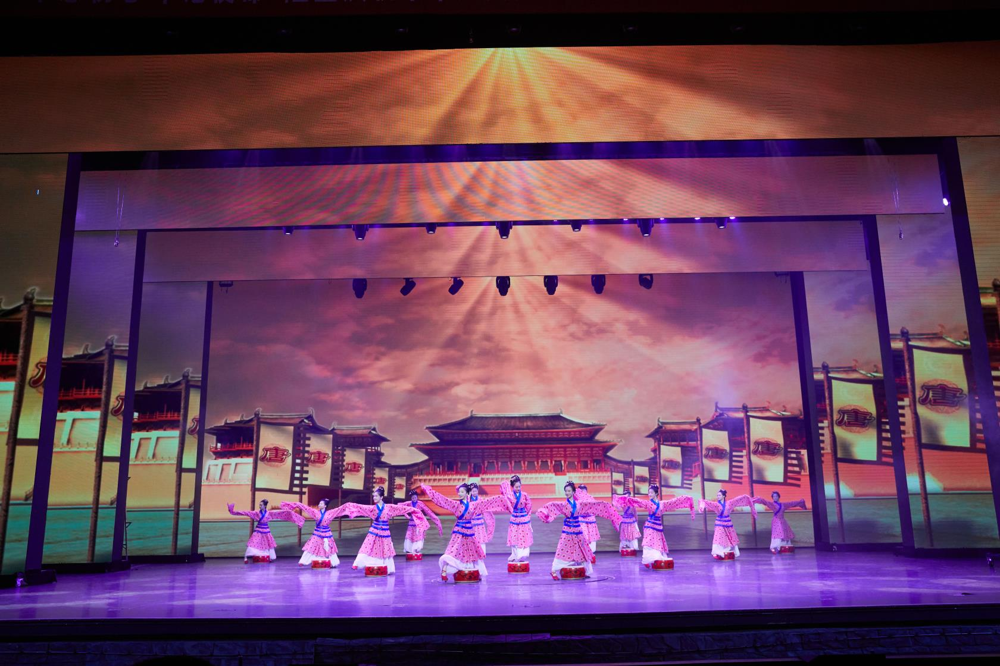

# 沧州铭扬杂技艺术中等专业学校欢迎您

沧州铭扬杂技艺术中等专业学校是培养艺术人才的专业学校。铭扬学校于2010年12月2日被国家教育部、民政部批准为“铭扬艺术中等专业学校”，民办中专院校正式确立。

铭扬学校投资1000余万元，占地30亩，建有办公楼、教学楼、宿舍楼、练功厅，投资120万元购进教学设备300件套，图书1.6万册，能够满足600余人的学习训练要求。

学校有中国舞、国际标准舞、戏剧表演、声乐、钢琴、魔术杂技等相关专业，面向全国和河北省内招生。按高考教育改革课程标准设置开设初、高中课程。学校实行全日制封闭式寄宿管理，学校有一支老中青结合的专职师资队伍，他们均来自知名高等艺术院校，有十分扎实的专业技能，杂技教师则来自各大杂技演出团体，具备国家一级演员职称。自成立以来，培育了大批专业人才，为艺术事业的繁荣与发展做出了应有的贡献。学校2010、2011年度被政府授予“吴桥县杂技文化旅游发展先进单位”获得政府嘉奖。2011年学校节目《中国结》、《旗人》，在央视《我要上春晚》节目中播出，2019年参加吴桥县委县政府庆祝建国70周年文艺汇演，第十七届吴桥国际杂技艺术节吴桥分会场演出，获得一致好评。

铭扬学校近年来组织各专业学生相继去俄国、英国、美国、日本、土耳其、德国、西班牙、瑞士、韩国等20余个国家文艺演出。促进中外艺术文化的交流和发展，为繁荣和发展世界艺术做出了新的贡献；在国内，学校和北京恭王府、承德大剧院、浙江横店影视城、湖北赤壁等众多演出单位签订了常年演出合同，并为此作为我们的实训基地，锻炼学员的同时又促进了各演出团体之间的合作与交流。

学校正以其办学信誉卓著，发展势头强劲，专业特色鲜明，师资力量雄厚，毕业前景广阔等优势，不断扩大办学规模，迅速提升办学层次，向着一流艺术院校迈进。

[2018沧州铭扬杂技艺术中等专业学校年度质量报告.doc](./2018沧州铭扬杂技艺术中等专业学校年度质量报告.doc)

[2019沧州铭扬杂技艺术中等专业学校年度质量报告.docx](./2019沧州铭扬杂技艺术中等专业学校年度质量报告.docx)

