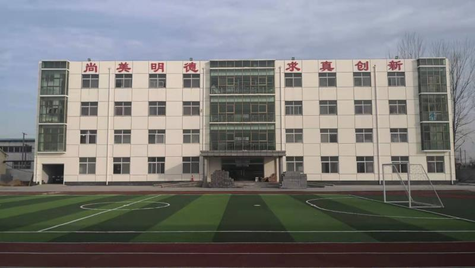

# 吴桥铭扬杂技艺术中等专业学校欢迎您

吴桥铭扬杂技艺术中等专业学校是专门培养杂技、魔术人才的专业学校。铭扬杂技学校于2010年12月2日被国家教育部、民政部批准为“铭扬杂技艺术中等专业学校”，民办中专院校正式确立。

铭扬杂技艺术中等专业学校投资1000余万元，占地30亩，建有办公楼、教学楼、宿舍楼、练功厅，投资120万元购进教学设备300件套，图书1.6万册，能够满足600余人的学习训练要求。

学校现有中职教师22人，专业教师14人，其中4名专业教师具有国家一级演员职称，10人具有国家助理级演员以上职称；文化课老师8人，都具有教师资格证书，本科以上学历；后勤服务人员10名。学校成立以来，培育了大批杂技人才，为杂技事业的繁荣与发展做出了应有的贡献。学校2010、2011年度被政府授予“吴桥县杂技文化旅游发展先进单位”获得政府嘉奖。2011年杂技节目《中国结》、《旗人》，在央视《我要上春晚》节目中已经播出，获得全国人民好评。

吴桥铭扬杂技艺术中等专业学校坐落于驰名中外的杂技之乡—吴桥，以深厚的杂技文化底蕴和杂技资源做基础，把享誉世界的吴桥杂技作为自己的文化品牌。主要经营以吴桥杂技为内容的杂技教育、杂技旅游、杂技对外演出、杂技道具生产、杂技题材影视出版等五大对外杂技文化产品。

吴桥铭扬杂技艺术中等专业学校近几年来相继与俄国、英国、美国、日本、土耳其、德国、西班牙、瑞士、韩国等20余个国家签订了演出合同。促进中外杂技艺术的交流和发展，为繁荣和发展世界杂技艺术做出了新的贡献；在国内，学校和北京恭王府、承德大剧院、浙江横店影视城、湖北赤壁等众多演出单位签订了常年演出合同，并为此作为我们的实训基地，锻炼学员的同时又促进了各演出团体之间的合作与交流。

吴桥是世界杂技文化的摇篮，在世界的影响力越来越大，以吴桥命名的中国吴桥国际杂技艺术节已成功举办十四届，该节现已成为国家级三大艺术节之一。

吴桥铭扬杂技艺术中等专业学校将借助于“吴桥杂技”这一张世界名片，继续做大做强。我们将不断创新、研发新颖的杂技节目，培养优秀的杂技人才，力争创作出一大批符合自身条件，迎合观众喜好，适合时代发展的好作品。争取把吴桥杂技最美好的一面呈现给国人，将中国最优秀的杂技艺术带到世界各地，用“吴桥杂技”架起中外友好桥梁。

[2018沧州铭扬杂技艺术中等专业学校年度质量报告.doc](./2018沧州铭扬杂技艺术中等专业学校年度质量报告.doc)

[2019沧州铭扬杂技艺术中等专业学校年度质量报告.docx](./2019沧州铭扬杂技艺术中等专业学校年度质量报告.docx)

